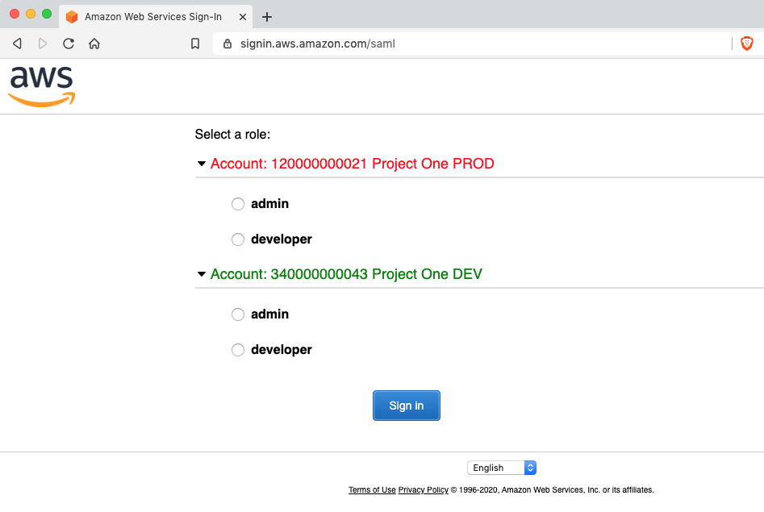
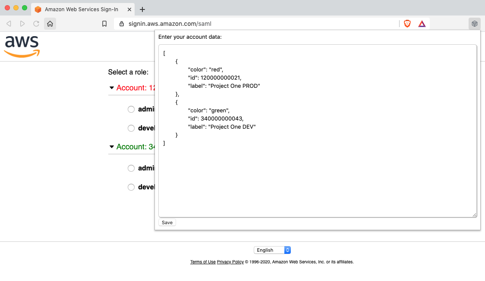
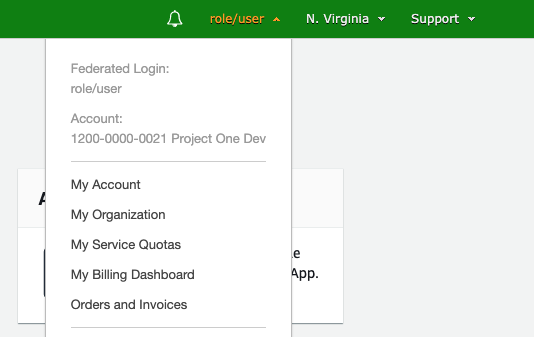

# AWS Console Customizer

Allows you to customize the display of your AWS account ids for the SAML signin page: https://signin.aws.amazon.com/saml
- Font color of the account listing
- Custom label after the account id
    - Dev, Test, Prod, Project Name, etc.
    
## Usage
<div>
    
</div>
<div>
    
</div>
<div>
    
</div>

## Installation for Chrome/Brave
- Clone this repository on your local filesystem
- Open Extension Manager in Chrome/Brave browser: <a href="about://extensions">about://extensions</a>
- Turn on "Developer mode"
- Click on the "Load unpacked" button
- Browse to the directory on your local system where you cloned the source code
- Click the extension button that is now in your browser 
- Configure your account settings as desired
```json
[
	{
		"color": "red",
		"id": 120000000021,
		"label": "Project One PROD"
	},
	{
		"color": "green",
		"id": 340000000043,
		"label": "Project One DEV"
	}
]
```

## Installation for Firefox
- Use a distribution of Firefox that allows unsigned extensions
    - Firefox Developer Edition, Firefox Nightly, Firefox Extended Support Release
- Package the extension into a zip file
```shell script
zip -r -FS ../aws-console-customizer.zip * --exclude '*.git*'
```
- Disable the extension signing requirement in Firefox (about:config)
```properties
xpinstall.signatures.required=false
```
- Open the Add-on manager (about:addons) 
- Browse to and open the file from the location where it was saved
- See documentation if needed: https://extensionworkshop.com/documentation/publish/distribute-sideloading/#install-addon-from-file

Note: Firefox Developer Edition has a dark theme by default. You may not be able
to see the new button that is added to the browser in the extension buttons area.
You can change the theme to either the standard or light theme if needed.
